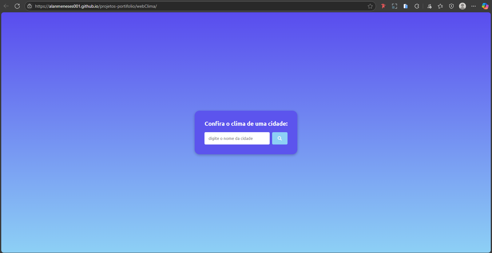
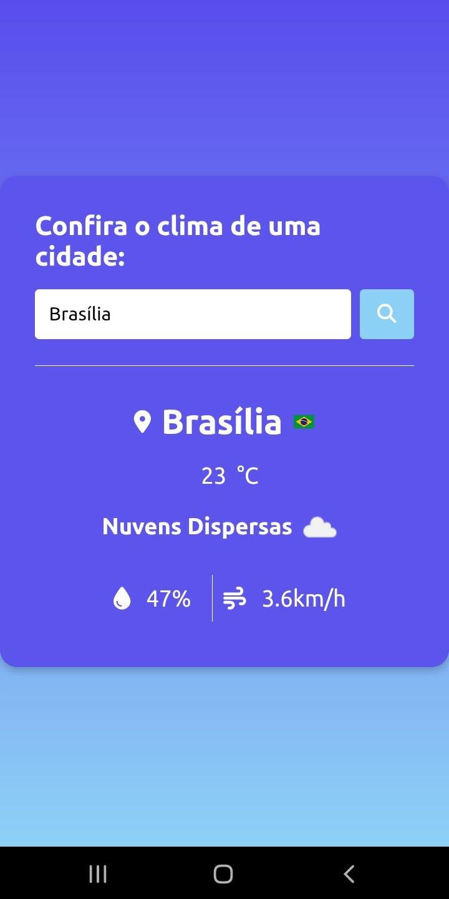

# 🌦️ Web Clima

Aplicação simples em JavaScript que consome a [API OpenWeatherMap](https://openweathermap.org/) para exibir informações climáticas de qualquer cidade do mundo, como temperatura, umidade, vento e condições do tempo em tempo real.

🚀 **Projeto online:**  
[https://alanmeneses001.github.io/projetos-portifolio/webClima/](https://alanmeneses001.github.io/projetos-portifolio/webClima/)

 
 
---

## 🚀 Funcionalidades

- 🔍 Pesquisa de clima por nome da cidade
- 📍 Mostra cidade, país e bandeira
- 🌡️ Temperatura atual
- ☁️ Descrição do clima com ícone
- 💧 Umidade do ar
- 💨 Velocidade do vento
- 🇧🇷 Interface em português (pt-BR)
- 📱 Responsivo para desktop e mobile

---

## 🧠 Tecnologias utilizadas

- HTML5
- CSS3
- JavaScript (ES6+)
- API [OpenWeatherMap](https://openweathermap.org/)
- Ícones: [Font Awesome](https://fontawesome.com/)

---
